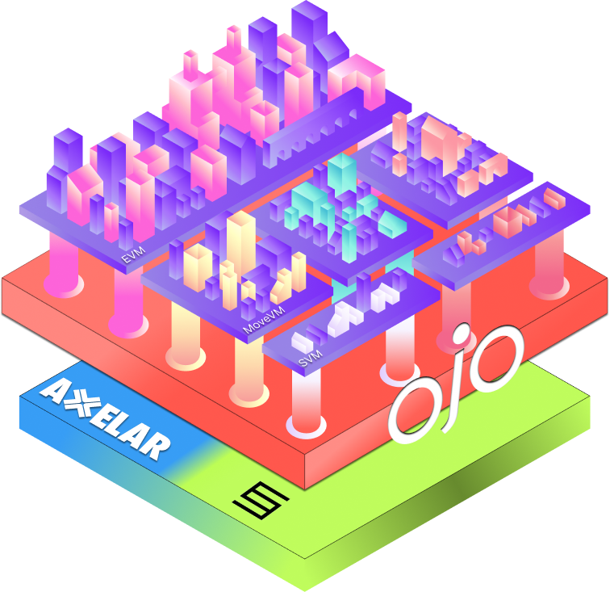

<p align="center">
    
</p>

Ojo-evm is a set of contracts which use Axelar's GMP to request data from the Ojo blockchain and relay it back to the EVM. It is the simplest way to implement pull-style price feeds for any protocol on EVM.

## Table of Contents

- [Table of Contents](#table-of-contents)
- [Flow](#flow)
- [Gas](#gas)
- [Integration](#integration)
  - [Example](#example)
  - [Alternate Example](#alternate-example)
- [Deployments](#deployments)


## Flow

Ojo-evm is a pull-style oracle which executes DeFi transactions after oracle updates are successful. If they do not succeed or time out, the DeFi transaction will not go through. This design was created to stop tx-spam attacks on EVM, and to minimize the delta between DeFi transactions and oracle updates.

1. User executes a DeFi transaction
2. The DeFi contract requests an Ojo update. During this request, the DeFi contract sends along the parameters and function to call after the oracle update goes through.
3. The oracle update request goes through Axelar's GMP
4. Axelar's GMP relays the message over IBC to the Ojo blockchain
5. The Ojo blockchain reaches into its KV store to read the current price data
6. The Ojo blockchain constructs an IBC message to Axelar to call GMP with the current price info
7. The GMP message is relayed to the Ojo EVM contract, which updates its state with current price info
8. If the oracle message did not time out, the ojo evm contract executes the DeFi function

## Gas

Customers pay to use the Ojo oracle contract only in Axelar's GMP fees. These funds are relayed to the Ojo chain and then sent back to the EVM side in order to pay for gas fees.

During transactions such as borrowing, non-gas funds are never sent to the Ojo blockchain; they remain on the local contract.

## Integration

Integrating with Ojo on EVM is very simple, thanks to Axelar's General Message Passing (GMP).

During a transaction, a contract may request price data from the Ojo oracle prior to updating state. For example, in a lending protocol, this should be done during the execution of a borrow, collateralization, or liquidation. Each time a user transacts, they first pull oracle data into the contract, and then perform state changes according to the price data.

### Example

We are going to create the [MockOjo](./contracts/MockOjo.sol) contract, which is an example that integrates Ojo price feeds in a promise-based design.

Add the necessary import headers:

```solidity
import "@axelar-network/axelar-gmp-sdk-solidity/contracts/executable/AxelarExecutable.sol";
import "@axelar-network/axelar-gmp-sdk-solidity/contracts/interfaces/IAxelarGateway.sol";
import "@axelar-network/axelar-gmp-sdk-solidity/contracts/interfaces/IAxelarGasService.sol";
import "@axelar-network/axelar-gmp-sdk-solidity/contracts/interfaces/IERC20.sol";
import "@ojo-network/ojo-evm/contracts/IOjo.sol";
import "@ojo-network/ojo-evm/contracts/OjoTypes.sol";
```

Create an instance of Ojo in your contract & add a constructor:

```solidity
contract MockOjo {
    IOjo public immutable ojo;

    constructor(address ojo_) {
        ojo = IOjo(ojo_);
    }
}
```

Create a private DeFi function, which will *use* Ojo price data, but will not request it. This will be used in a later step:

```solidity
function setBalance(
    bytes32[] calldata assetNames,
    bytes calldata commandParams
) internal {
    (uint256 multiplier) = abi.decode(commandParams, (uint256));
    for(uint256 i = 0; i < assetNames.length; i++){
        OjoTypes.PriceData memory priceData = ojo.getPriceData(assetNames[i]);

        if (priceData.price > 0) {
            Balance memory balance = Balance({
                assetName: assetNames[i],
                amount: priceData.price * multiplier
            });

            balances.push(balance);
        }
    }
}
```

Finally, create the public function which will call an Ojo oracle update. Once the oracle update is finished, the private DeFi function will be called.

```solidity
function setBalanceWithOjoPriceData(
    bytes32[] calldata assetNames,
    uint256 multiplier
) external payable {
    bytes memory commandParams = abi.encodePacked(multiplier);

    ojo.callContractMethodWithOjoPriceData{value: msg.value}(
        assetNames,
        address(this),
        MockOjo.setBalance.selector,
        commandParams
    );
}
```

Please reference the [MockOjo](./contracts/MockOjo.sol) contract to test against Ojo, and see our [testnet deployments](https://docs.ojo.network/integrate/evm).

### Alternate Example

If your contract requires continual updates instead of performing pull-style updates, this is still possible. Please note that this is not advised for mainnet releases and can result in tx-spam attacks.

Simply create a contract that will request oracle updates:

```solidity
    function relayOjoPriceData(
        bytes32[] calldata assetNames
    ) external payable {
        bytes memory commandParams = "0x";

        ojo.callContractMethodWithOjoPriceData{value: msg.value}(
            assetNames,
            address(this),
            OjoTypes.EMPTY_COMMAND_SELECTOR,
            commandParams
        );
    }
```

Set up a chron job that continually performs these pull operations, and set your previously internal DeFi function to be external:

```solidity
function setBalance(
    bytes32[] calldata assetNames,
    bytes calldata commandParams
) external {
    (uint256 multiplier) = abi.decode(commandParams, (uint256));
    for(uint256 i = 0; i < assetNames.length; i++){
        OjoTypes.PriceData memory priceData = ojo.getPriceData(assetNames[i]);

        if (priceData.price > 0) {
            Balance memory balance = Balance({
                assetName: assetNames[i],
                amount: priceData.price * multiplier
            });

            balances.push(balance);
        }
    }
}
```

## Deployments

These contracts are deployed everywhere listed [in our docs](https://docs.ojo.network/integrate/evm). Do not trust other addresses as they are not maintained by Ojo.
